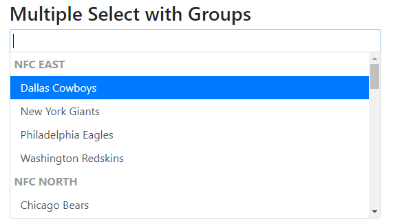

# bootstrap4-chosen

Based on the wonderful [bootstrap-chosen](https://github.com/alxlit/bootstrap-chosen) by alxlit, this aims
matching your [Chosen 1.0](http://harvesthq.github.com/chosen/) elements with bootstrap 4 styling.

[](#)

### Installation

Get it with your favourite package manager:

`npm i bootstrap4-chosen`, `yarn add bootstrap4-chosen` or what ever floats your boat.

### Usage

You can use `bootstrap4-chosen` by importing its source files after importing
the bootstrap 4 variables.

```scss
// Bootstrap 4 Sources
@import "~bootstrap/scss/bootstrap";
@import "~bootstrap4-chosen/bootstrap4-chosen";
```

#### Prebuilt CSS

You can find a plain css version (using default variables) as bootstrap4-chosen.css.

### Examples

You can browse some examples in the attached example.html file.

### Pitfalls

- bootstrap4-chosen, unlike bootstrap-chosen, does not include Less sources.
- bootstrap4-chosen will not work with bootstrap 3.
- bootstrap4-chosen works at least with bootstrap 4 beta

- Always make sure to include bootstrap 4 scss variables, mixins and functions or your scss won't compile.
This way, styling is really dependant on your variable setup.

### License

The MIT License